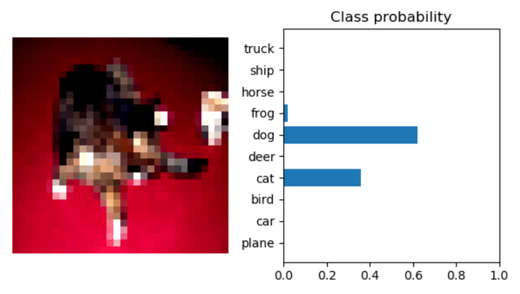

# Generating a convolutional neural network using the Pytorch library for image classification
> This project features the necessary steps to generate a complete CNN for image classification in Python using the Pytorch library. The Datasets used for this project are the ones of [**CIFAR 10**](https://pytorch.org/docs/stable/torchvision/transforms.html). CIFAR-10 consists in 60k (32x32) RGB images, labeled with an integer from 0 to 9, corresponding to 10 classes mentioned as following.

The classifications of the images are determined as follows:
1. plane
2. car
3. bird
4. cat
5. deer
6. dog
7. frog
8. horse
9. ship
10. truck

# Neural Network model Architecture

The Neural Network model is composed by 6 layers, from which the first 3 are convolutional and the rest are linear layers. The architecture is found as follows:

> 
3 x 32 x 32 (input)

        | kernel size = (3,3); padding = 1; stride = 1; output channels = 16;
        V  operation: Convolution; activation: ReLu;

16 x 32 x 32

        | kernel size = (2,2); stride = 2; 
        V operation: Max Pooling

16 x 15 x 15

        | kernel size = (3,3); padding = 1; stride = 1; output channels = 32; 
        V operation: Convolution; activation: ReLu;

32 x 15 x 15

        | kernel size = (2,2); stride = 1;
        V operation: Max Pooling;

32 x 8 x 8

        | kernel size = (3,3); padding = 1; stride = 1; output channels = 64;
        V operation: Convolution; activation ReLu;

64 x 8 x 8

        | kernel size = (2,2); stride = 1;
        V operation: Max Pooling;

64 x 4 x 4

        | operation: Flatten; output: 1-dimensional tensor with size (1024);
        V

500

        | operation: Linear; activation: ReLu;
        V

128

        | operation: Linear; activation: ReLu;
        V

10

        | operation: Linear; activation: logaritmic softmax;
        V

    OUTPUT CLASSIFICATION

## CLASSIFICATION RESULTS

> The resulting classification is represented as the probability of the image being each of the forementioned classes. Each of the class labels has a probability value presented as *0 < p(x) < 1 for x in each label*. Once all of the probabilities *p(x)* have been calculated in the forementioned *CNN*, a comparison is performed between each of the probabilities of the classes, and the highest probability is the resulting class of the image. 

# Datasets Normalization

The normalization vectors in the main fuction are calculated following the procedure as follows:
1. Get all the images in the training portion of the dataset, and stack them in a (k, j, i, n) tensor.
> In the resulting tensor the representations are determined as follows:
         *k*: color channels of each image;
         *j*: the height of each image;
         *i*: the width of each image;
         *n*: the number of color images in the dataset;

2. Once this *4-d* tensor has been calculated, flatten all of the dimensions excluding the first in order to get a *2-d* tensor with dimensions (k, j\*i\*n), hereby known as **R tensor**, with dimensions (k, m).

3. Calculate the mean and vector std vectors by operating on the dimension *m* of the resulting **R tensor**.
